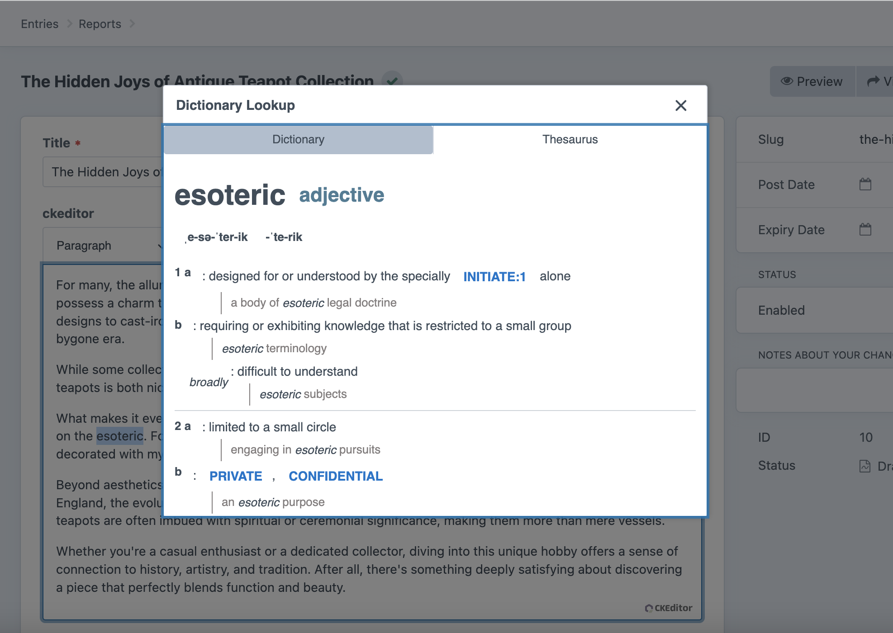
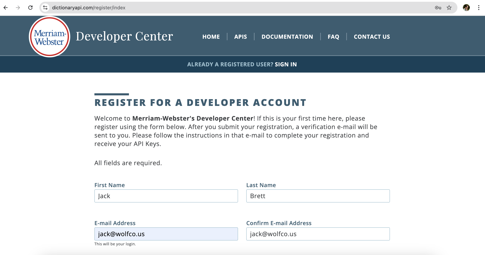
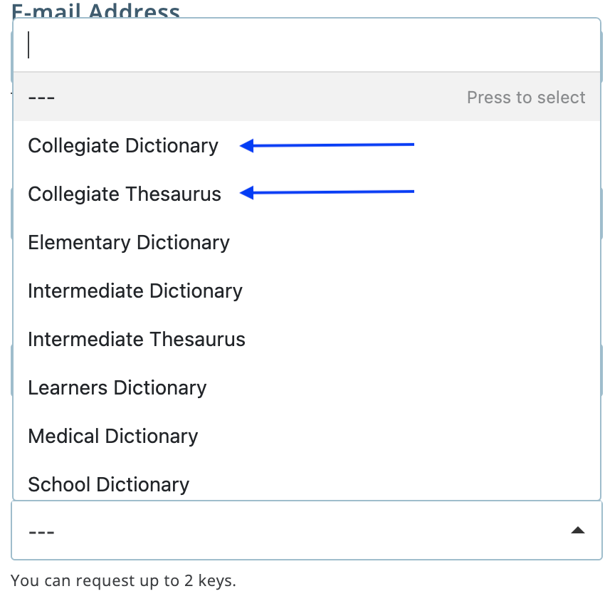
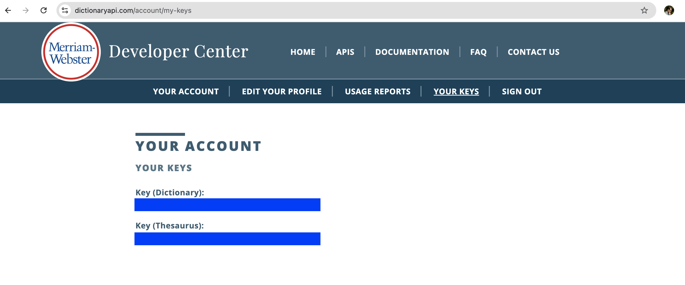
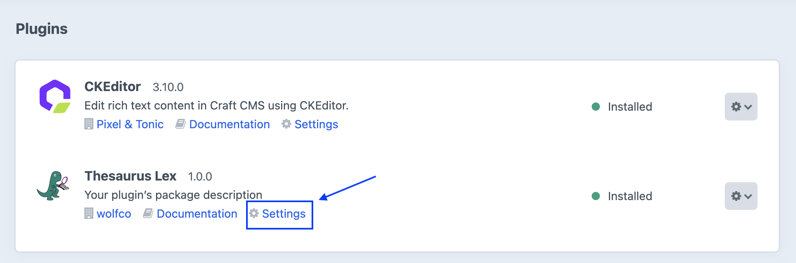
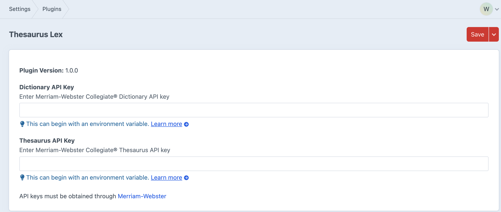
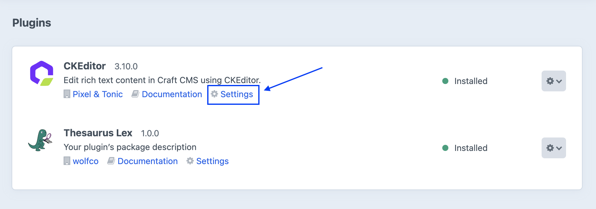
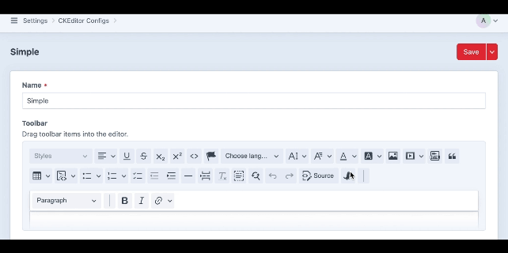

# Thesaurus Lex

Thesaurus Lex is a custom Craft CMS plugin that integrates Merriam-Webster's dictionary and thesaurus APIs into CKEditor fields. This plugin enables users to quickly look up definitions and synonyms for the selected word.


## Requirements

- Craft CMS 4.0.0 or later.
- CKEditor (version compatible with Craft CMS installation)
- Merriam-Webster API keys for **Collegiate Dictionary** and **Collegiate Thesaurus**.

---

## Installation

To install Thesaurus Lex in a Craft CMS application:

1. Navigate to the root of your Craft CMS project.
2. Run the following commands:

   ```bash
   composer require wolfco/craft-thesaurus-lex
   ```

   ```bash
   /path/to/my/craft plugin/install thesaurus-lex
   ```

---


## Setup

### Register for Merriam-Webster API Keys

1. Register for a free Merriam-Webster account at [dictionaryapi.com](https://dictionaryapi.com/register/index).
   
2. During registration, select **Collegiate Dictionary** and **Collegiate Thesaurus** in the API request fields.
   
3. Note the API keys provided for each service.
   
4. Ensure your Craft application is non-commercial and adheres to Merriam-Webster's [Terms of Service](https://dictionaryapi.com/info/terms-of-service). API usage must remain below 1000 requests per day to qualify for the free tier.

### Configure Plugin Settings

1. Navigate to **Settings** -> **Plugins** -> **Thesaurus Lex** -> **Settings** in the Craft CMS control panel.
   
2. Enter the API keys obtained from Merriam-Webster and save settings.
   

### Add the ThesaurusLex Button to CKEditor

1. Go to **Settings** -> **Plugins** -> **CKEditor** -> **Settings** in the Craft CMS control panel.
   
2. Select the CKEditor field you want to enhance (e.g., "Simple").
3. Under **Toolbar**, drag the **ThesaurusLex** button from the top toolbar (available buttons) to the bottom toolbar (included buttons) and save configuration.
   

### Ensure CKEditor Field Availability

Make sure your Craft CMS application has at least one Entry Type with a CKEditor field defined. For guidance on setting up Entry Types and Sections, refer to [Craft CMS Documentation](https://craftcms.com/docs).

---

## Usage

1. Open an entry with a CKEditor field where the **ThesaurusLex** button has been added.
2. Highlight a word and click the **ThesaurusLex** button, or click the button without highlighting a word to enter a lookup manually.
3. A modal will appear with:
   - **Dictionary Tab**: Displays definitions from Merriam-Webster's Collegiate Dictionary API.
   - **Thesaurus Tab**: Displays synonyms from Merriam-Webster's Collegiate Thesaurus API.
4. Click a synonym in the **Thesaurus Tab** to replace the highlighted word in CKEditor.
